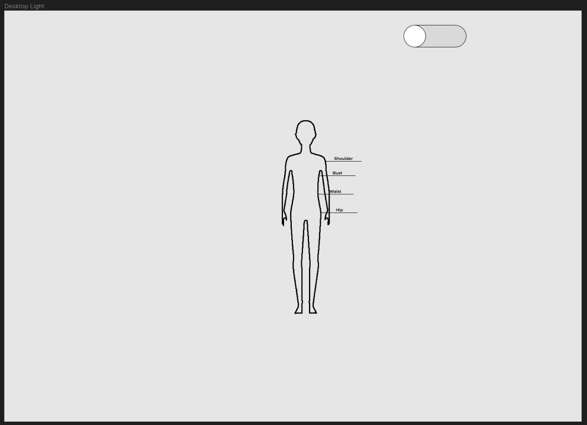
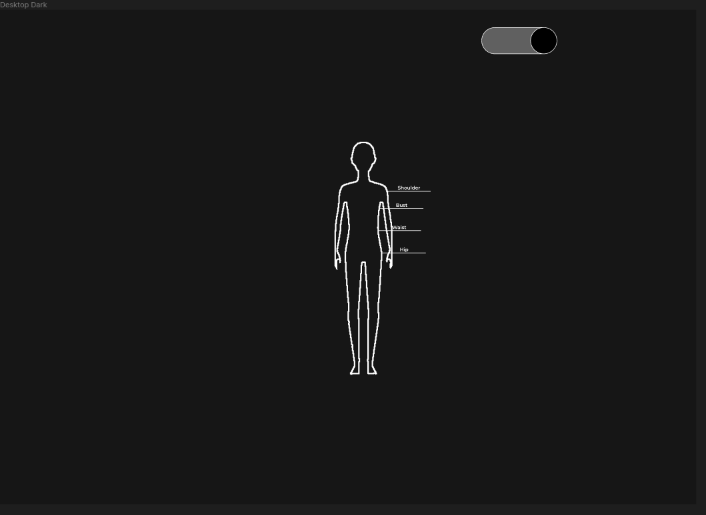
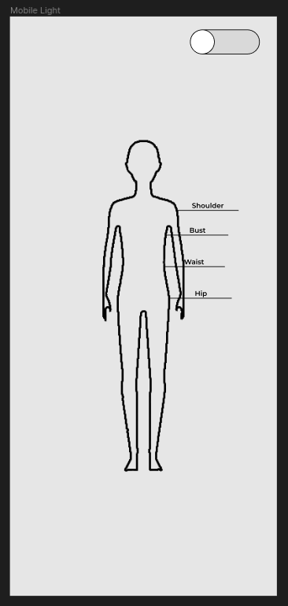
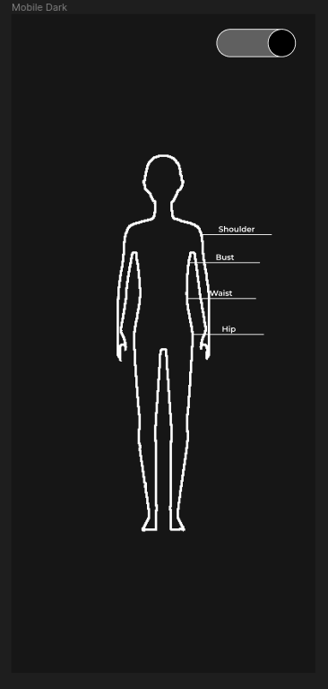
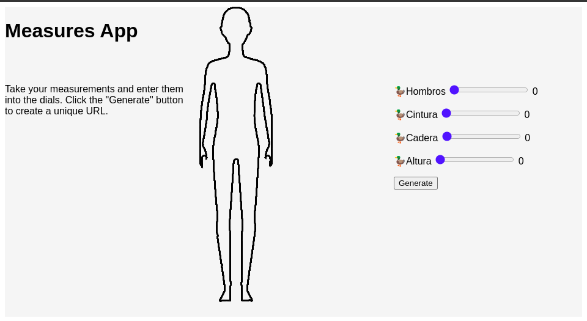
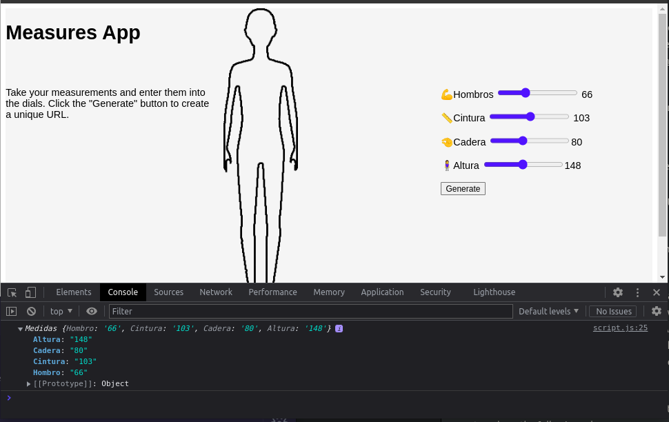
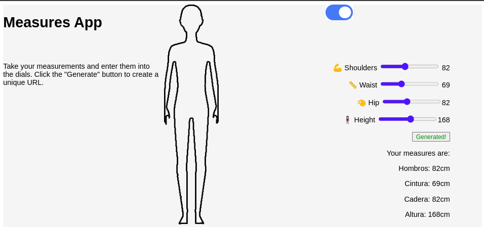
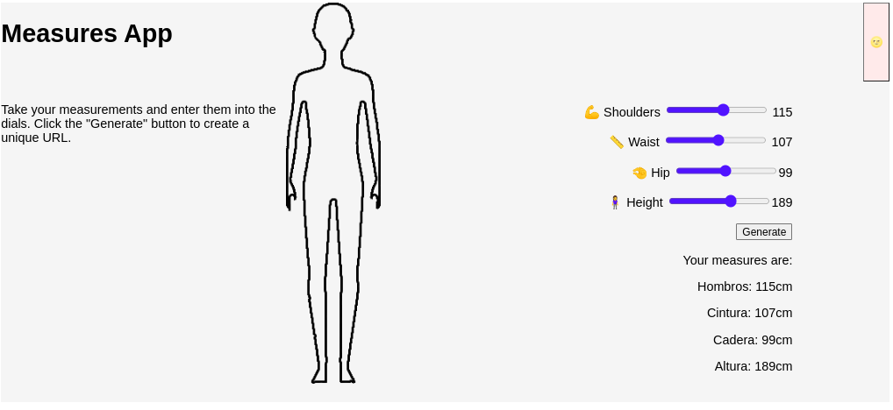
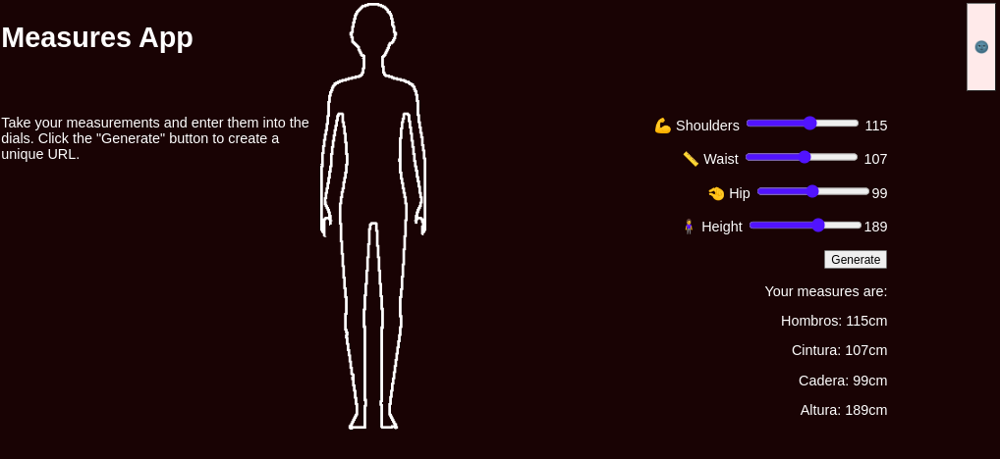

# Body Measure App
A simple HTML, CSS, JS App, for taking notes on your body measures.

This project will try to use vanilla CSS and JS. 

The final project will have a unique URL for name, measures and a mobile version.

### Figma Sketchup/Prototypes
---

### Version: 0.1
---

### Version: 0.2
---

### Version: 0.3
---

### Version: 0.4
---

#### DarkMode

### Version: 0.5
---

